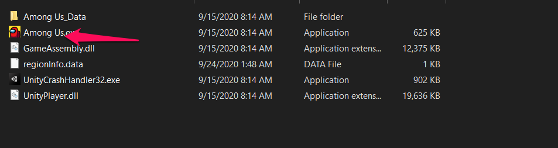
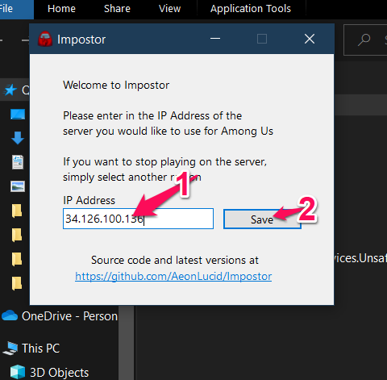

# Among Us private

## 0. Dành cho ai chưa tải game

### B1: Tải file zip và giải nén: [Link](https://github.com/KaitoRyouga/among-us-private/releases/download/1.0.0/among-us-windows.zip)

### B2: Run file .exe và chơi

## 1. Laptop

### B1: Download file zip và giải nén: [Link](https://github.com/KaitoRyouga/among-us-private/releases/download/1.0.0/Impostor-Client-win-x64.zip)

### B2: Run file .exe

### B3: Nhập IP: ``34.126.100.136`` và nhấn `Save`

### B4: Tắt `Among Us` và bật lại

### Done !!!

### Note: Sau khi chuyển server sang public, muốn chuyển lại server pravite thì phải làm lại từ đầu

---

## 2. Android

### B1: Tải file này: [regionInfo.dat](https://github.com/KaitoRyouga/among-us-private/releases/download/1.0.0/regionInfo.dat)

### B2: Đi tới đường dẫn ``/sdcard/Android/data/com.innersloth.spacemafia/files``

### B3: Xóa file regionInfo.dat và chép file mới tải ở trên vào đây

### Done !!!

### Note: Sau khi chuyển server sang public, muốn chuyển lại server pravite thì phải làm lại từ đầu